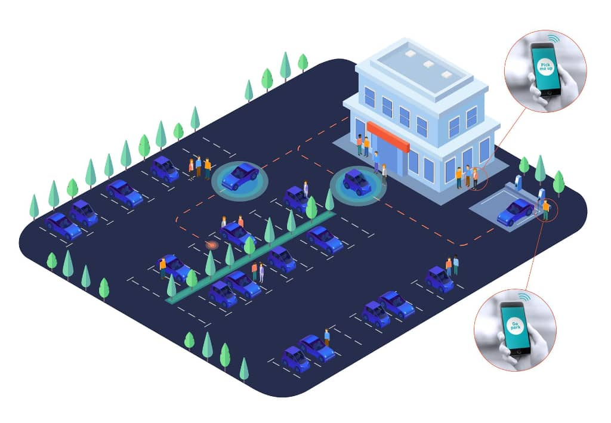

Autoware.Auto {#index}
======================

# Introduction {#index-introduction}

[Autoware](https://www.autoware.org/) is the world's first "all-in-one" open-source
software for self-driving vehicles hosted under the Autoware Foundation. Autoware first began with
the [Autoware.AI project](https://www.autoware.ai/), based on
[ROS 1](http://wiki.ros.org/Documentation).

Autoware.Auto, another project from the Autoware Foundation, is a clean slate rewrite
of Autoware.AI based on [ROS 2](https://index.ros.org/doc/ros2/). Compared
to Autoware.AI, Autoware.Auto has the best possible software engineering practices which includes PR
reviews, PR builds through CI, 100% documentation, 100% code coverage, style guide, development, and
release process.

Autoware.Auto has two other major differentiators when it's compared to Autoware.AI:

1. Crisply defined interfaces for different modules (messages and APIs)
2. An architecture designed for determinism, such that it is possible to reproduce behaviors on live
machines and development machines

# Use Cases  {#index-use-cases}

Autoware.Auto initially targets the following 2 use cases:

1. Autonomous Valet Parking
2. Autonomous Depot Maneuvering

After the initial set of [milestones](https://gitlab.com/autowarefoundation/autoware.auto/AutowareAuto/milestones)
are completed, Autoware.Auto will allow you to easily map a parking lot, create
a map for autonomous driving, and drive over this parking lot entirely autonomously; all in less
than 2 weeks.

# Supported Hardware {#index-supported-hardware}

1. **Vehicle**: Lexus 450 LH with the
[Pacmod 3.0](https://autonomoustuff.com/product/small-ev-by-wire-kits/) DBW interface
2. **Sensors**:
    1. 4 [VLP-16](https://velodynelidar.com/vlp-16-hi-res.html) (or comparable sensors, e.g.
      VLP-32C)
    2. 16 Sonar sensors
    3. 4 [cameras](http://wiki.ros.org/pointgrey_camera_driver) (180 degree FOV)
    4. [Novatel GPS](https://autonomoustuff.com/product/novatel-vehicle-kits/)
3. **ECUs**:
    1. [Nvidia AGX Xavier](https://www.nvidia.com/en-us/deep-learning-ai/products/agx-systems/) aarch64 computer
    2. [Nuvo](https://autonomoustuff.com/product/astuff-spectra/) rugged x86-64 desktop computer

# Documentation {#index-documentation}

The latest documentation corresponding to the `master` branch of `AutowareAuto` is located here:
https://autowarefoundation.gitlab.io/autoware.auto/AutowareAuto/.

# Roadmap  {#index-roadmap}

Functional features in Autoware.Auto are developed according to the roadmap below. More granular
feature planning is being handled via
[GitLab milestones](https://gitlab.com/autowarefoundation/autoware.auto/AutowareAuto/milestones).

# Installation and development {#index-installation-and-development}

Install Autoware.Auto and learn how to develop applications.

- @subpage installation-and-development

# Development process guide {#index-cpp-development-process}

Guidelines for contributing to Autoware.Auto.

- @subpage cpp-development-process

# Links to other resources {#index-links-to-other-resources}

- @subpage howto
- @subpage tutorials
- @subpage design "Design documents"
- @subpage coverage "Coverage reports"
