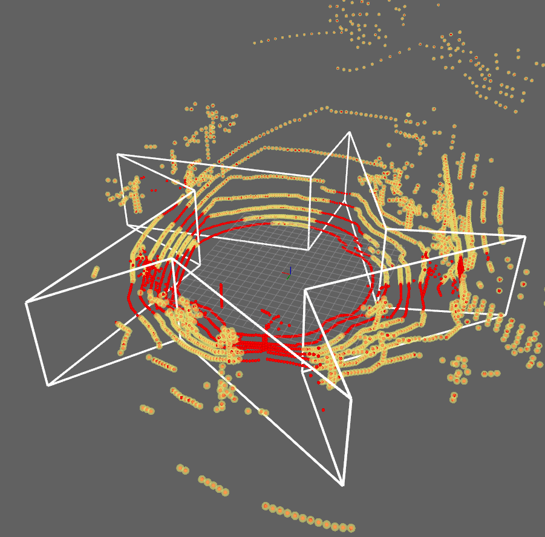
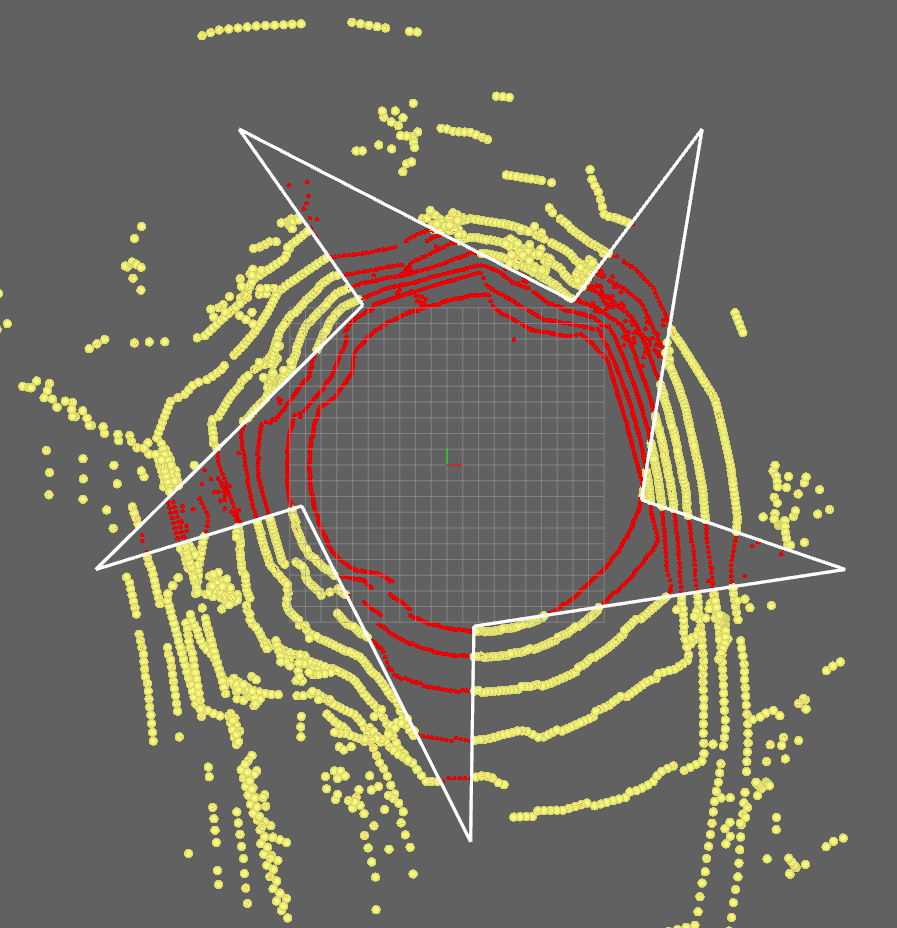

polygon_remover {#polygon_remover-package-design}
===========

This is the design document for the `polygon_remover` package.

# Purpose / Use cases

<!-- Required -->
<!-- Things to consider:
    - Why did we implement this feature? -->
This package allows user to remove a given convex or concave polygon shaped area
from a given PointCloud2 message. The package ignores z-values(height) of the
points and removes based on the x and y values.




- Red Points: Input Point Cloud
- Yellow Points: Output Point Cloud

# Design

<!-- Required -->
<!-- Things to consider:
    - How does it work? -->
The package contains a class named `PolygonRemover`. It expects you to construct
an instance of it. And once an instance is generated, the user can utilize it in
either 2 ways:

- Give it a polygon first then give it a cloud. (`update_polygon`
  then `remove_updated_polygon_from_cloud`)
- Give it a polygon and cloud together. `remove_polygon_cgal_from_cloud`

And it will return a polygon filtered point cloud.

Optionally it can also provide a marker for polygon shape visualization.

## Assumptions / Known limits

<!-- Required -->

- Input is a series of points either clockwise or counter-clockwise. First and
  last points of the input will be connected.

- Input point list should have at least 3 points.

- The input points should be given in the frame of input point cloud. The
  package will not perform frame transformations.

- Polygon should be provided before a point cloud is given or with the point
  cloud. Otherwise the package will return the incoming point cloud as it is
  with an `INFO` message.

- The code doesn't check the z values at all. It will filter out any point as
  long as
  `x and y` values of the points are within the polygon.

- If visualization is enabled, the marker for polygon will get its frame_id from
  the point cloud provided. It is better to make sure a cloud is fed at least
  once before the `get_marker` method is used.

## Inputs / Outputs / API

<!-- Required -->
<!-- Things to consider:
    - How do you use the package / API? -->
Simple example:

```cpp
polygon_remover::PolygonRemover polygon_remover(true); // will_visualize = true

PointCloud2::SharedPtr cloud_ptr = std::make_shared<Shape>(); // Some point cloud
Shape::SharedPtr shape_ptr = std::make_shared<Shape>(); // And put at least 3 points to the shape

// Either first initialize
polygon_remover.update_polygon(shape_ptr);

// then filter
PointCloud2::SharedPtr cloud_filtered_ptr =
polygon_remover.remove_updated_polygon_from_cloud(cloud_ptr);

// Or provide cloud and polygon together
PointCloud2::SharedPtr cloud_filtered_ptr =
polygon_remover.remove_polygon_geometry_from_cloud(cloud_ptr, shape_ptr);

// If you allowed visualization you can get a Marker for visualization
Marker marker = polygon_remover.get_marker();
// Marker will get its frame_id from the cloud once it has been provided.
```

## Inner-workings / Algorithms

<!-- If applicable -->
This package
uses [The Computational Geometry Algorithms Library (CGAL)](https://github.com/CGAL/cgal)
library to construct polygons as 
`std::vector<CGAL::Exact_predicates_inexact_constructions_kernel::Point_2>` objects.

And it uses
[Ray Casting Algorithm](https://en.wikipedia.org/wiki/Point_in_polygon#Ray_casting_algorithm) 
to check whether a point is resides within a polygon or not as implemented in:
[CGAL](https://doc.cgal.org/latest/Polygon/group__PkgPolygon2Functions.html#ga0cbb36e051264c152189a057ea385578).

## Error detection and handling

<!-- Required -->
Throws:

- `polygon_geometry_to_cgal` method will throw
  `std::length_error("Polygon vertex count should be larger than 2.");`
  if polygon vertex count is less than 3.
- `remove_updated_polygon_from_cloud` method will throw
  `std::runtime_error(
  "Shape polygon is not initialized. Please use update_polygon first.");`
  if polygon is not initialized yet.

# Security considerations

<!-- Required -->
<!-- Things to consider:
- Spoofing (How do you check for and handle fake input?)
- Tampering (How do you check for and handle tampered input?)
- Repudiation (How are you affected by the actions of external actors?).
- Information Disclosure (Can data leak?).
- Denial of Service (How do you handle spamming?).
- Elevation of Privilege (Do you need to change permission levels during execution?) -->
To Be Determined.

# References / External links

<!-- Optional -->

- https://en.wikipedia.org/wiki/Point_in_polygon#Ray_casting_algorithm
- https://github.com/CGAL/cgal

# Future extensions / Unimplemented parts

<!-- Optional -->
Not Available.

# Related issues

<!-- Required -->
https://gitlab.com/autowarefoundation/autoware.auto/AutowareAuto/-/issues/995