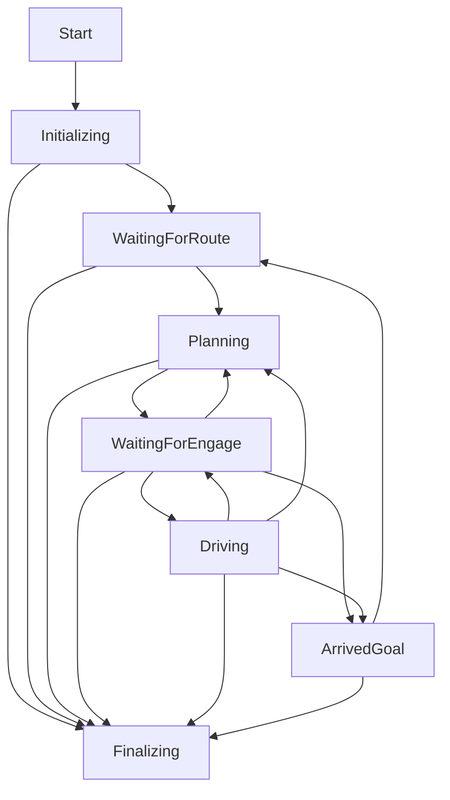

Autoware State Monitor {#autoware_state_monitor}
===========

This is the design document for the `autoware_state_monitor` package.

# Purpose / Use cases

The purpose of the `autoware_state_monitor` is to present a system state in a compact form.

# Design

The current state is generated based on the observations of multiple sources
and the state machine (below diagram).

Possible states:
* *Initializing*
* *WaitingForRoute*
* *Planning*
* *WaitingForEngage*
* *Driving*
* *ArrivedGoal*
* *Finalizing*

In each update of the state machine the inputs are checked and the new state is generated.
For example, before transition to `ArrivedGoal` state, the component checks
if the vehicle is close to the goal and if the vehicle is stopped.

## Inputs / Outputs / API / Parameters

Parameters
* `update_rate` determines the state machine loop frequency.
* `arrived_distance_threshold` is a distance threshold that determines how close to the goal
  the vehicle should be to consider goal as reached.
* `stopped_velocity_threshold_mps` is a velocity threshold below which the vehicle
  is considered to be stopped.
* `stopped_time_threshold` is a time threshold. If the vehicle velocities are below the threshold
  for specified time then the vehicle is considered to be stopped.
* `wait_time_after_initializing` is a delay after `Initializing` state, before switch to the new state
* `wait_time_after_planning` is a delay after `Planning` state, before switch to the new state
* `wait_time_after_arrived_goal` is a delay after `ArrivedGoal` state, before switch to the new state

Inputs
* `autoware_auto_msgs/msg/Engage` is used to check if the vehicle has been engaged or not.
* `autoware_auto_msgs/msg/HADMapRoute` is used to extract goal point and correct
  transitions between states.
* `autoware_auto_msgs/msg/VehicleOdometry` is used to calculate a current vehicle velocity.
* `autoware_auto_msgs/msg/VehicleStateReport` is used to determine if the vehicle
  is in manual or autonomous mode.
* `tf/tfMessage` is used to determine a vehicle pose in a global frame.

Outputs
* `autoware_auto_msgs/msg/AutowareState` contains the system state.

Services
* `std_srvs/srv/Trigger` (/autoware/shutdown) is used to request shutdown of
  the system (i.e. to enter the `Finalizing` state).

# Related issues

- #1236 - Implement Autoware State Monitor
- #821 - Detect when nodes' incoming messages are skipped